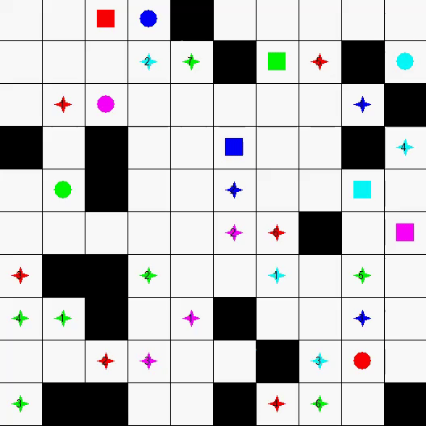
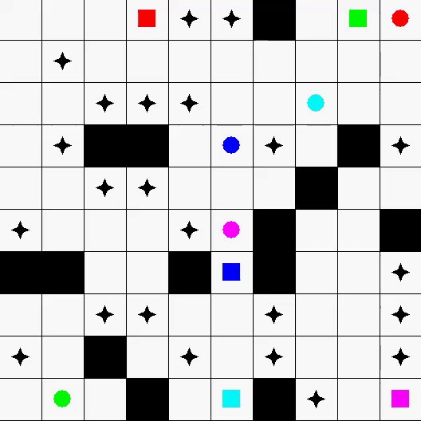

# Multi-Robot-Path-Planning-for-Each-Robot-with-Several-Jobs-in-a-Single-Trip

This is the code of paper Multi-Robot Path Planning for Each Robot with Several Jobs in a Single Trip
If you want to use it, please cite

@article{hu2020multi,  
  title={Multi-Robot Path Planning for Each Robot with Several Jobs in a Single Trip},    
  author={Hu, Biao and Xu, Shengjie and Cao, Zhengcai},    
  journal={IFAC-PapersOnLine},    
  volume={53},    
  number={5},  
  pages={279--284},    
  year={2020},    
  publisher={Elsevier}    
}
Assigned Jobs(Square: Represents AGV (Automated Guided Vehicle), Pentagram: Represents assigned tasks for AGVs with corresponding colors, Numbering: Indicates the execution sequence of the tasks.)  

Unassigned Jobs(Square: Represents AGV (Automated Guided Vehicle), Pentagram: Represents corresponding unassigned tasks.)  

